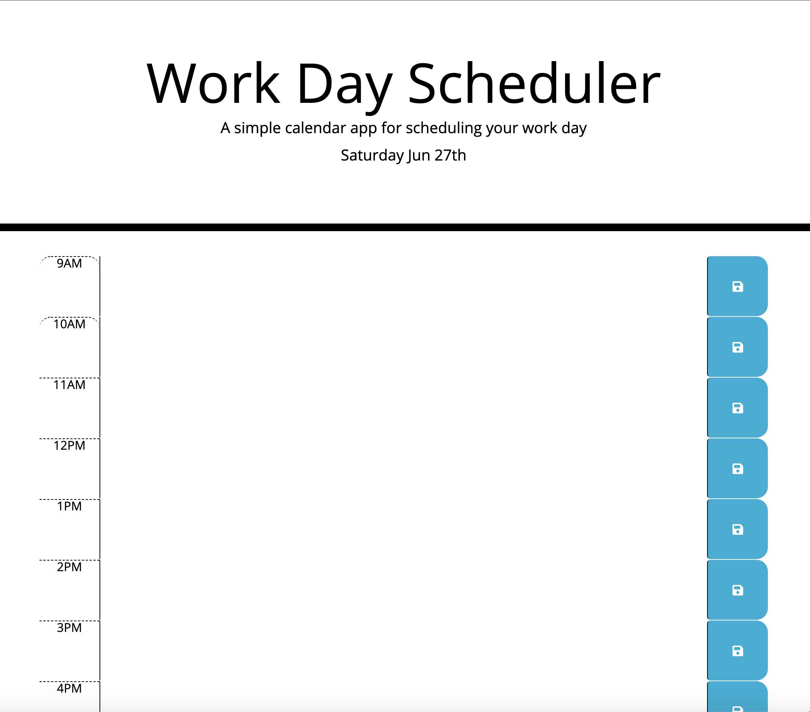

# work-day-scheduler

This is a homework assignment for Case Western Reserve University Coding Bootcamp. The purpose of this assignment is to create a daily calendar.

Links to websites:

https://github.com/michellew179/work-day-scheduler/

https://michellew179.github.io/work-day-scheduler/

Screenshot of website:

